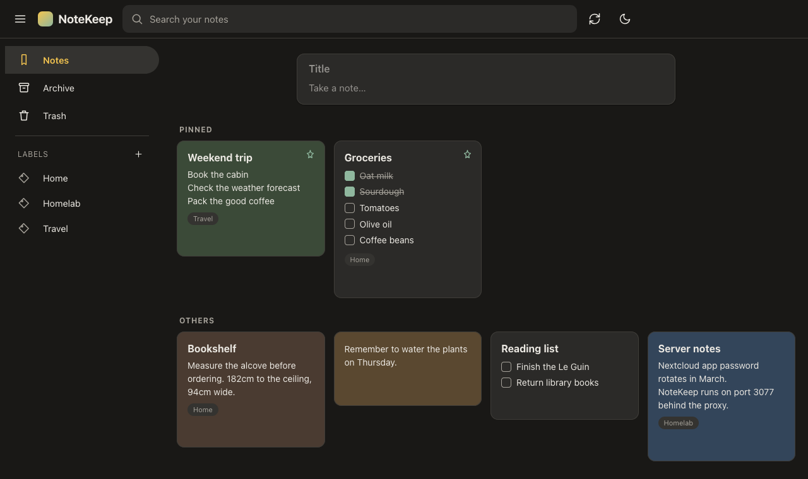
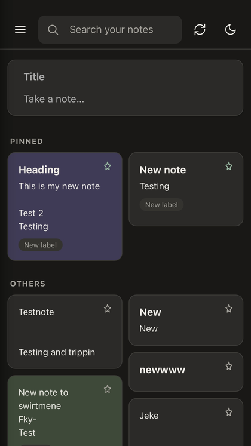
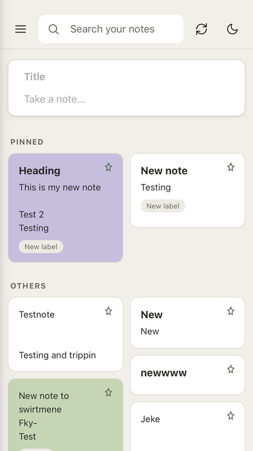
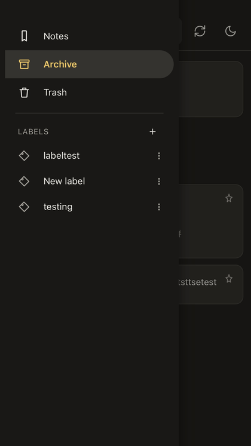
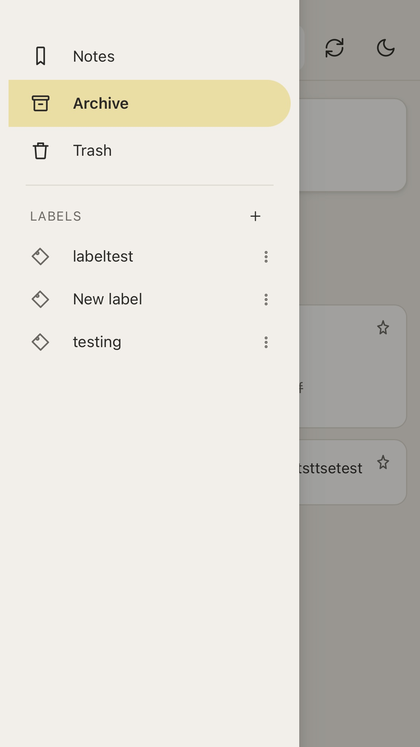

# NoteKeep

A self-hosted, Google Keep–style notes app that stores your notes in **your own
Nextcloud** as a single plain JSON file. Pin them, colour them, turn them into
checklists, label, archive, trash and drag-reorder them in a masonry grid.

No Google account, no telemetry, no third-party servers, no CDNs at runtime.
Installs as a PWA on phone and desktop and works offline.



<table>
  <tr>
    <td align="center"><br><sub>Notes — dark</sub></td>
    <td align="center"><br><sub>Notes — light</sub></td>
    <td align="center"><br><sub>Labels — dark</sub></td>
    <td align="center"><br><sub>Labels — light</sub></td>
  </tr>
</table>


## Requirements

- A **Nextcloud** you can create an app password on
- **Node.js 18+** (or Docker) on a machine your devices can reach
- For offline support: **HTTPS** — any reverse proxy that terminates TLS will
  do (see step 4)

Three runtime dependencies (`express`, `webdav`, `dotenv`). No build step, no
bundler, no framework.

## How it works

```
Your phone/laptop  ──HTTPS──►  NoteKeep server (small Node app)  ──WebDAV──►  Your Nextcloud
     (PWA, installable)              runs on your home server           (stores NoteKeep/data.json)
```

- The **frontend** is a Progressive Web App (installable on iOS, Android,
  Windows, macOS, Linux — add it to your home screen / dock like a native app).
  It caches everything locally (IndexedDB) so it works offline and loads instantly.
- The **backend** is a tiny Node/Express server. It holds your Nextcloud
  app-password once, server-side, and proxies note reads/writes to a WebDAV
  folder. This avoids Nextcloud's CORS restrictions and means no device ever
  stores your Nextcloud credentials.
- All your devices point at this one NoteKeep server's URL. Edit on your
  phone, it's on your laptop within ~20 seconds (or instantly if you tap the
  sync icon).

## 1. Get a Nextcloud app password

In Nextcloud: **Settings → Security → Devices & sessions → Create new app
password**. Copy it — you won't see it again.

## 2. Configure

```bash
cd notekeep
cp .env.example .env
```

Edit `.env`:

```
NEXTCLOUD_URL=https://cloud.yourdomain.com
NEXTCLOUD_USERNAME=yourname
NEXTCLOUD_APP_PASSWORD=xxxxx-xxxxx-xxxxx-xxxxx-xxxxx
NOTES_FOLDER=NoteKeep
PORT=3077
APP_TOKEN=
```

`NOTES_FOLDER` is created automatically in your Nextcloud if it doesn't exist.

`APP_TOKEN` is optional. If you expose NoteKeep beyond your home network
(see below), set it to a long random string — the app will then ask each
device for that token once and remember it. On a trusted LAN-only setup you
can leave it blank.

## 3. Run it

```bash
npm install
npm start
```

Visit `http://<your-server-ip>:3077` from any device on your network to check
it works. **Don't stop here if you want offline support** — see step 4.

**Keep it running permanently** with a process manager, e.g.:

```bash
npm install -g pm2
pm2 start server.js --name notekeep
pm2 save
pm2 startup
```

Or with Docker — the repo ships a `Dockerfile` and a `.dockerignore`:

```bash
docker build -t notekeep .
docker run -d --name notekeep -p 3077:3077 --env-file .env --restart unless-stopped notekeep
```

`docker-compose.truenas.yml` is a reference for deploying on TrueNAS SCALE as
a Custom App (bind-mount the project folder, no image build required).

## 4. Serve it over HTTPS (needed for offline)

Browsers only register a service worker — the thing that caches the app so it
can launch with no server reachable — on a secure origin. So `http://<ip>:3077`
is fine for a quick look, but offline support needs HTTPS.

In practice that means putting NoteKeep behind a reverse proxy on its own
hostname, proxying to `localhost:3077`. Caddy, Traefik and Nginx Proxy Manager
all obtain and renew a certificate for you. Tailscale is another easy route: it
issues trusted HTTPS certificates for tailnet hostnames.

If your browser shows a certificate warning on the app's URL, offline will not
work no matter what: service workers stay disabled on an origin with a
certificate error, and clicking "continue anyway" does not re-enable them. A
normal padlock means you are fine.

## 5. Install it on your devices

Open the **HTTPS** NoteKeep URL from step 4 in a browser, then:
- **iOS Safari**: Share → Add to Home Screen
- **Android Chrome**: menu → Install app
- **macOS/Windows/Linux (Chrome/Edge)**: address bar → install icon
- **Firefox**: works as a regular tab; installable support varies by platform

Install from the HTTPS address, not a LAN IP — whichever URL you add to the
home screen is the origin the app is stuck with, and an insecure one can never
work offline.

Each install talks to the same NoteKeep server, so every device sees the
same notes.

### Checking it actually worked

Add `#debug` to the app URL once — e.g. `https://notes.example.com/#debug`.
That enables debug mode for that device and stays on until you visit
`#debug-off`; nothing is shown to anyone who has not opted in. The build number
then appears at the bottom of the sidebar.

That number is how you confirm an update actually reached the browser. If it
has not changed, nothing else you observe is meaningful yet — check that before
concluding anything about a change. (It is also always printed to the browser
console at startup.)

Tapping it opens a diagnostics panel: origin, secure context, service worker
state, cached shell files, notes held locally. The field to read there is the
service worker line:

- `offline-ready · shell 11/11` — cached and good. Close the app fully and
  reopen it with the server unreachable to confirm.
- `sw-pending` — registered but not in control yet; reload once.
- `no-sw (untrusted cert?)` — the browser is withholding service workers.
  Usually a private browsing window, or a certificate the browser does not
  trust (see step 4).
- `no-https!` — you opened it over `http://`. See step 4.
- `shell 4/11` or similar — the cache is incomplete; reload once with the
  server reachable and it will top itself up.

## 6. Remote access (optional)

If you want NoteKeep from outside your network, the safe options are a VPN
(WireGuard, Tailscale) or your existing reverse proxy on its own subdomain
proxying to `localhost:3077`. If you do expose it to the open internet, set
`APP_TOKEN` to a long random string — otherwise anyone who finds the URL can
read and write your notes.

## Data format

Everything lives in one file: `<NOTES_FOLDER>/data.json` in your Nextcloud,
plain JSON, human-readable, easy to back up (Nextcloud already versions and
backs it up like any other file) or inspect/migrate later:

```json
{
  "notes": [
    {
      "id": "...", "type": "text | checklist", "title": "...", "body": "...",
      "items": [{ "id": "...", "text": "...", "checked": false }],
      "color": "default | coral | peach | ...", "pinned": false,
      "archived": false, "trashed": false, "trashedAt": null,
      "labels": ["labelId"],
      "order": 10, "createdAt": 0, "updatedAt": 0
    }
  ],
  "labels": [{ "id": "...", "name": "..." }]
}
```

## Notes on sync behavior

- Local edits save instantly to the device (IndexedDB) and are pushed to
  Nextcloud ~1.2 seconds after you stop typing.
- The app pulls fresh data every 20 seconds while open, plus immediately on
  opening, on reconnecting to the network, and when you tap the sync icon.
- With no server reachable the app still opens, and every edit is kept locally
  and pushed the next time it can reach Nextcloud.
- If two devices edit while offline from each other, NoteKeep merges by
  note: whichever copy of a given note was edited most recently wins, rather
  than one whole device's changes overwriting the other's.
- Trash is auto-purged after 7 days, same as Google Keep.

## What's intentionally not included

- No reminders/notifications, no image attachments, no collaborators. The data
  format above is simple enough to extend later if you want any of that.
- No frameworks, no bundler, no build step, and no third-party CDNs at runtime
  (SortableJS is vendored into the repo). Editing a file and reloading is the
  whole development loop.

## Security notes

- Your Nextcloud app-password lives only in `.env` on the server. It is never
  sent to a browser — the frontend only ever talks to this app's `/api/*`.
- `.env` is gitignored and dockerignored. `.env.example` holds placeholders
  only; keep it that way.
- `APP_TOKEN` gates `/api/*` only, never the static files — the app shell has
  to stay fetchable for the service worker to cache it. It protects your notes
  data, not the existence of the page.
- All note content is HTML-escaped before rendering.

## Trying it locally first

Even without Nextcloud, you can sanity-check the UI: point `.env` at any
WebDAV server you have (or skip real sync and just poke around — the app
will show "offline" but stays fully usable, since everything also lives in
local IndexedDB).

## Contributing

Issues and pull requests are welcome. The whole app is four files worth
reading: `server.js`, `public/index.html`, `public/js/app.js` and
`public/sw.js`. There is no build step — edit a file and reload.

If you change anything under `public/`, bump `BUILD_ID` at the top of
`public/js/app.js`, and bump `CACHE` in `public/sw.js` if you touch the service
worker. The build number is the only way to tell a deploy apart from a cached
copy, and debugging without it wastes hours.

## Licence

MIT — see [LICENSE](LICENSE).

## Built with

Written with [Claude Code](https://claude.com/claude-code), Anthropic's agentic
coding tool. Individual commits carry `Co-Authored-By` trailers where it
contributed.
